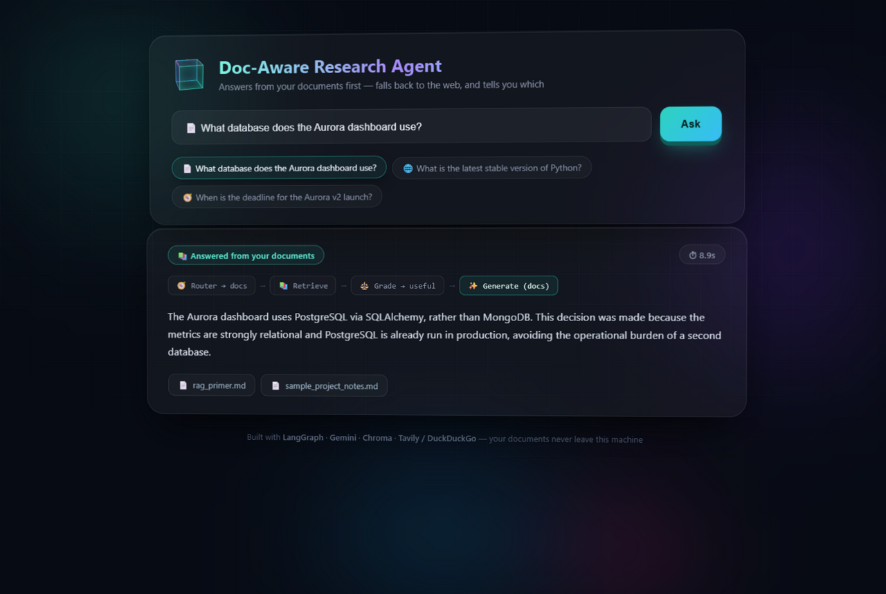
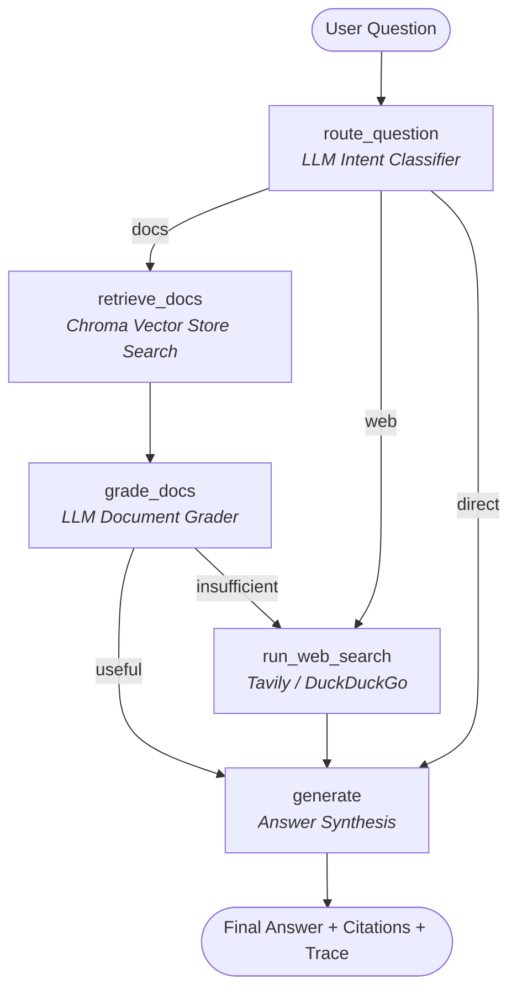

# 🤖 Doc-Aware Research Agent

[](https://www.python.org/)
[](https://python.langchain.com/docs/langgraph)
[](https://python.langchain.com/)
[](https://aistudio.google.com/)
[](https://www.trychroma.com/)
[](LICENSE)

An intelligent, stateful **Adaptive RAG (Retrieval-Augmented Generation)** research agent built with **LangGraph**, **LangChain**, and **Google Gemini**. The agent answers questions by consulting your **private document collection first**, dynamically grading context relevance, and seamlessly falling back to **public web search** (Tavily or DuckDuckGo) whenever document knowledge is missing or insufficient.

---

## 📸 Web Interface Preview

The application comes with a modern, glassmorphism Web UI featuring real-time state visualization of the LangGraph execution pipeline, drag-and-drop document indexing, and 3D mouse-tracking interaction:



---

## 🌟 Key Features

- **🧠 Adaptive Query Routing**: An LLM router classifies input intent into `docs` (private files), `web` (public search), or `direct` (greetings/small talk) to minimize latency and token consumption.
- **🛡️ Self-Corrective RAG (CRAG)**: Evaluates vector search results via a strict LLM grader. If retrieved chunks are topically adjacent but fail to answer the specific question, the system auto-routes to web search to prevent hallucinations.
- **⚡ Incremental Document Upload & Indexing**: Drag-and-drop `.pdf`, `.md`, `.txt`, and `.docx` files straight from the Web UI. Files are split into vector chunks and indexed into ChromaDB immediately.
- **🔍 Dual Web Search Fallback**: Seamlessly falls back to Tavily API search (or zero-config DuckDuckGo if no Tavily API key is provided).
- **📊 Transparent Reasoning & Citations**: Every generated answer reports step-by-step trace execution logs, exact source types (`docs`, `web`, `direct`), and citations (file paths or URLs).
- **🖥️ Dual Interface**: Use via an interactive Command Line Interface (CLI) or a RESTful Flask server with a responsive web dashboard.

---

## 🏗️ System Architecture & Workflow

The research agent is powered by a **LangGraph state machine** executing the following cyclic workflow:



```
                     ┌─────────────────┐
        question ──> │  route_question │  LLM router: docs / web / direct
                     └───────┬─────────┘
            ┌────────────────┼──────────────────┐
          "docs"           "web"             "direct"
            │                │                  │
   ┌────────▼───────┐        │                  │
   │ retrieve_docs  │        │                  │
   │ (RAG over      │        │                  │
   │  Chroma)       │        │                  │
   └────────┬───────┘        │                  │
   ┌────────▼───────┐        │                  │
   │   grade_docs   │ LLM grades whether the chunks
   └───┬────────┬───┘ actually answer the question
       │        │
    useful   insufficient
       │        │
       │   ┌────▼──────────┐
       │   │ run_web_search│  Tavily (or DuckDuckGo fallback)
       │   └────┬──────────┘
       ▼        ▼
     ┌──────────────┐
     │   generate   │  cited answer + source label
     └──────────────┘
```

### Flow Breakdown:
1. **`route_question`**: Classifies whether the query target is the user's private documents, public web info, or simple conversation.
2. **`retrieve_docs`**: Performs vector similarity search (top-k = 4) against the persisted ChromaDB index using Gemini embeddings.
3. **`grade_docs`**: Evaluates whether retrieved content directly answers the prompt.
4. **`run_web_search`**: Triggered when routed to `web` OR when `grade_docs` marks context as `insufficient`.
5. **`generate`**: Generates a concise response strictly using the validated context, attaching clear citations.

---

## 💡 LLM & RAG Deep Dive

### What is RAG and Why Use It?
Standard Large Language Models (LLMs) rely on pre-trained parametric knowledge. They suffer from two major limitations:
1. **Knowledge Cutoff & Lack of Private Context**: They cannot answer questions about your proprietary projects, internal documentations, or personal notes.
2. **Hallucinations**: When asked about specialized or obscure facts, LLMs tend to generate plausible-sounding but false statements.

**Retrieval-Augmented Generation (RAG)** overcomes this by retrieving relevant text chunks from an external database (ChromaDB) and feeding them into the LLM context window at runtime.

### Why Adaptive / Corrective RAG?
Naive RAG systems always feed vector search results to the LLM. If your query isn't in your docs, the vector database still returns the "least irrelevant" chunks. Naive LLMs will either hallucinate an answer from bad context or fail ungracefully.

**Doc-Aware Research Agent implements Adaptive / Corrective RAG**:
- **Intent Guard**: Skips vector database lookups for general/web queries.
- **Relevance Guard**: Uses structured Pydantic outputs (`DocGrade`) to grade chunks. If context is deemed `insufficient`, it routes to live web search rather than hallucinating from bad local documents.

### Tech Stack & Models Used

| Component | Technology | Why Used |
|---|---|---|
| **Orchestration** | `LangGraph` | Explicit state graph management for conditional routing, retries, and step tracing |
| **LLM Engine** | Google Gemini `gemini-3.5-flash-lite` | Ultra-fast inference, structured output support (Pydantic), free tier API access |
| **Embedding Model** | Google Gemini `gemini-embedding-001` | 768-dimensional semantic embeddings with high vector similarity precision |
| **Vector Database** | `Chroma` | Lightweight, open-source, local persistence without external server dependencies |
| **Text Chunking** | `RecursiveCharacterTextSplitter` | Chunks docs into 1000-char windows with 150-char overlap to preserve context boundaries |
| **Web Search** | `Tavily API` / `DuckDuckGo` | Structured search API with fallback to free DuckDuckGo web scraper |
| **Web Framework** | `Flask` + HTML/JS/CSS | Minimalistic REST server with glassmorphism frontend |

---

## 🚀 Quick Start Guide

### Prerequisites
- **Python 3.10+** installed.
- A **Google Gemini API Key** (Free tier available at [Google AI Studio](https://aistudio.google.com/apikey)).
- *(Optional)* A **Tavily Search API Key** (Free tier at [Tavily AI](https://tavily.com)).

### 1. Clone the Repository
```bash
git clone https://github.com/krrish5235/DOC-Aware-Researchh-Agent.git
cd DOC-Aware-Researchh-Agent
```

### 2. Set Up Virtual Environment
```bash
# Windows
python -m venv venv
venv\Scripts\activate

# Linux / macOS
python3 -m venv venv
source venv/bin/activate
```

### 3. Install Dependencies
```bash
pip install -r requirements.txt
```

### 4. Configure Environment Variables
Copy `.env.example` to `.env` and set your API keys:
```bash
cp .env.example .env
```
Edit `.env`:
```env
GOOGLE_API_KEY=your_gemini_api_key_here
Tavily_API_KEY=your_tavily_api_key_here  # Optional: falls back to DuckDuckGo if blank
LLM_MODEL=gemini-3.5-flash-lite
EMBEDDING_MODEL=gemini-embedding-001
```

### 5. Index Your Initial Documents
Place your `.md`, `.txt`, `.pdf`, or `.docx` files into the `docs/` folder (two sample files are provided by default) and build the vector index:
```bash
python ingest.py
```

---

## 💻 Usage

### 1. Web UI Mode
Launch the web interface:
```bash
python app.py --serve
```
Open your browser and navigate to `http://127.0.0.1:5000`.
- **Upload Documents**: Drag & drop files onto the upload panel for real-time incremental vector indexing.
- **Ask Questions**: Type queries and view answer generation, dynamic step tracing, and cited sources.

### 2. Interactive CLI Mode
```bash
python app.py
```
Type your questions directly in the terminal prompt.

### 3. One-Shot CLI Query
```bash
python app.py "What chunking strategy is recommended in the notes?"
```

### 4. REST API Endpoint
Send JSON requests to the Flask server:
```bash
curl -X POST http://127.0.0.1:5000/ask \
     -H "Content-Type: application/json" \
     -d "{\"question\": \"When should I prefer RAG over fine-tuning?\"}"
```
**Example API Response:**
```json
{
  "question": "When should I prefer RAG over fine-tuning?",
  "answer": "RAG is preferred when knowledge changes frequently, exact source attribution is required, or when working with private domain documentation...",
  "source": "docs",
  "sources": [
    "D:\\projects\\docs\\rag_primer.md"
  ],
  "steps": [
    "router -> docs",
    "retrieve_docs",
    "grader -> useful",
    "generate (docs)"
  ],
  "elapsed": 1.4
}
```

---

## 📁 Project Structure

```
DOC-Aware-Researchh-Agent/
├── app.py          # CLI & Flask server entry points (/ask, /upload, /api/files)
├── graph.py        # LangGraph state machine (router, retriever, grader, generator)
├── tools.py        # RAG vector search & Web search tools (Tavily & DuckDuckGo)
├── ingest.py       # Document loaders, chunking, and ChromaDB vector indexing
├── config.py       # Environment configuration, model names, RAG hyperparameters
├── docs/           # Local document directory (.pdf, .md, .txt, .docx)
├── templates/      # Glassmorphism HTML/JS frontend interface
├── assets/         # Project screenshots and visual assets
├── .env.example    # Environment variable template
├── requirements.txt # Python package dependencies
└── LICENSE         # MIT Open Source License
```

---

## ⚙️ Hyperparameter Configuration

Customizable parameters in `config.py`:
- `CHUNK_SIZE = 1000`: Number of characters per text chunk.
- `CHUNK_OVERLAP = 150`: Overlap between adjacent chunks to maintain context continuity.
- `TOP_K = 4`: Number of vector matches retrieved per query.

---

## 📜 License

Distributed under the MIT License. See `LICENSE` for details.
